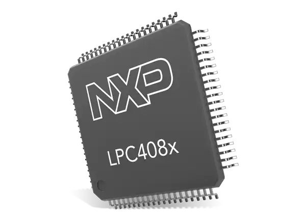

<p align="center">
  
</p>

# libhal-lpc40xx

[](https://github.com/libhal/libhal-lpc40xx/actions/workflows/ci.yml)
[](https://libhal.github.io/libhal-lpc40xx/coverage/)

Drivers for the LPC40xx series of microcontrollers conforming to the libhal
interface specification.

# [📚 Software APIs](https://libhal.github.io/libhal-lpc40xx/api)

# 📥 Install

## [Install libhal Prerequisites](https://libhal.github.io/prerequisites/)

## Using libhal-trunk (RECOMMENDED)

The "trunk" repository represents the latest packaged code based on github.

This command will insert `libhal-trunk` as the first server to check before
checking the conan center index. The second command will enable revision mode
which is required to use `libhal-trunk` in projects.

```bash
conan remote add libhal-trunk https://libhal.jfrog.io/artifactory/api/conan/trunk-conan --insert
conan config set general.revisions_enabled=True
```

# Building Demos

Before building any demos, we have to make the build directory

```bash
cd demos
mkdir build
cd build
```

The following examples will build every demo project available for the LPC40
series mcu. If you want to only build specific applications see
[Specifying a Toolchain Path](#specifying-a-specific-application).

## Debug Builds

Debug builds are helpful as they reduce the amount of compile time optimizations
in order to make the debugging experience better. This comes at the cost of
slower code and larger binary sizes.

To build with this level:

```
conan install .. -s build_type=Debug
source conanbuild.sh
cmake .. -DCMAKE_BUILD_TYPE=Debug -DCMAKE_TOOLCHAIN_FILE=conan_toolchain.cmake
make
```

## Release Builds

Release builds are harder to debug but are faster and have smaller binary sizes.

To build with this level:

```
conan install .. -s build_type=Release
source conanbuild.sh
cmake .. -DCMAKE_BUILD_TYPE=Release" -DCMAKE_TOOLCHAIN_FILE=conan_toolchain.cmake
make
```

## Specifying an Application

To specify a specific application, add a target to the build command. Here
are some examples:

```
make lpc4078_adc
make lpc4074_can
make lpc4088_interrupt_pin
```

The naming convention is "linker_script_name" (without the .ld extension) and
application name (without the .cpp extension)

# Flashing

There are a few ways to flash an LPC40 series MCU. The recommended methods are
via serial UART and JTAG/SWD.

## Using Serial/UART over nxpprog

`nxpprog` is a script for programming and flashing LPC40 series chips over
serial/UART. Using it will require a USB to serial/uart adaptor.

See the README on [nxpprog](https://github.com/libhal/nxpprog), for details on
how to use NXPPROG.

For reference the flash command is:

```
nxpprog --control --binary="main.bin" --device="/dev/tty.usbserial-140"
```

Replace "main.bin" with the path to your binary.
Replace "/dev/tty.usbserial-140" with the path to your serial port on your
machine.

## Using JTAG/SWD over PyOCD

`PyOCD` is a debugging interface for programming and also debugging ARM Cortex M
processor devices over JTAG and SWD.

This will require a JTAG or SWD debugger. The recommended debugger for the
LPC40 series of devices is the STLink v2 (cheap variants can be found on
Amazon).

Installation steps can be found here: https://pyocd.io/docs/installing

For reference the flashing command is:

```
pyocd flash main.bin --target lpc4088
```

Ignore the fact that the target is `lpc4088` as this name works for most
lpc40 series microcontrollers.

# Debugging using PyOCD

In one terminal:

```
pyocd gdbserver --target=lpc4088 --persist
```

In another terminal:

```
arm-none-eabi-gdb main.elf -ex "target remote :3333"
```
